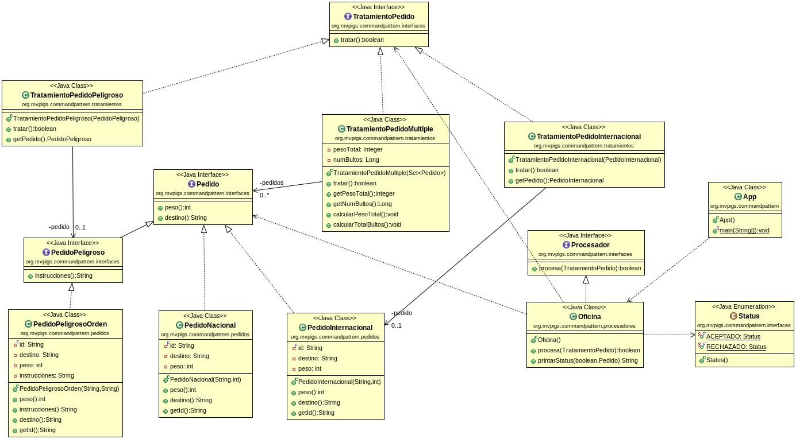

# Mordor Command Project
The Mordor Command Project is about to build an Application with a Program the logic of a post office that processes orders.

Depending on whether the order is processed or not, the office processes the order (true / false) and reports its status (accepted / rejected).

As the orders can be of multiple types, many of them still unknown and each with its particularities.

This Project belongs to a serie of projects to practice the most use Design Patter in Java. And This Project is a Task from "Programación" subject.

## This Project use Command Pattern

## IMPORTANT TO READ!!!:
All branches structure with their commits are in my Repository of my Personal Account too:

This repository is to upload the task of this project.
https://github.com/MateoGarciaG/mordor-command-MateoGarciaG

Test Cases are from the user @dfleta GitHub. The description of the task of this project that he mentions. It was the test cases cannot be modificated.
https://github.com/dfleta/mordor-command/blob/master/src/test/java/org/mvpigs/TestPedidos.java

<!--Logos-->

## Tabla de Contenidos

1. [Salida de la Aplicación](#salidas-de-la-aplicacion)
1. [Diagrama UML](#diagrama-uml)
1. [Tecnologías Usadas](#tecnologias-usadas)
1. [Reflexiones](#reflexiones)
1. [Licencia](#licencia)

---

## Salida de la Aplicación
Main App Code for this Kata Project provided by @dfleta Github User

**[⬆ back to top](#tabla-de-contenidos)**

## Diagrama UML
This UML Diagram is not mine. UML Diagram by @dfleta User GitHub
This UML Diagram use the Command Pattern.
The Package Structure will be the same as the UML Diagram of @dfleta due to in the README of his project put: "Respeta la estructura del proyecto indicada en el nombre de los paquetes que se indican en los casos test.". So indicates that the package structure must be respected.

**[⬆ back to top](#tabla-de-contenidos)**

## Tecnologías Usadas

- Java JDK 15
- Maven
- Visual Studio Code
- Git
Java:
- Streams Java

**[⬆ back to top](#tabla-de-contenidos)**

---

## Reflexiones
### Que has mejorado con este proyecto?
This project let me know a new Design Patter focused on Behavior to different of other Pattern that are focused on Creation of Objects. The great advantage of this pattern is that let us execute from a criteria how the behavior of the Request is going to be execute. All this from a COMMANDS that do this work of execute and check from a criteria. And after we have a Invoke Class which threat all Commands to execute them.
Other points to mention:
- Other point it's that I use my own ID Random generator, it's probably that due to it's random two Order Object have the same ID. So in the future I will change the Random Id generator to use the UUID Class to generate unique ID's.
- I used Streams Java feature and StringBuilder and Formatter to practice them

**[⬆ back to top](#tabla-de-contenidos)**

---

## Licencia

MIT License

Copyright (c) 2021 Mateo Garcia Gonzalez

Permission is hereby granted, free of charge, to any person obtaining a copy
of this software and associated documentation files (the "Software"), to deal
in the Software without restriction, including without limitation the rights
to use, copy, modify, merge, publish, distribute, sublicense, and/or sell
copies of the Software, and to permit persons to whom the Software is
furnished to do so, subject to the following conditions:

The above copyright notice and this permission notice shall be included in all
copies or substantial portions of the Software.

**[⬆ back to top](#tabla-de-contenidos)**

---

## Autor
Mateo Garcia Gonzalez